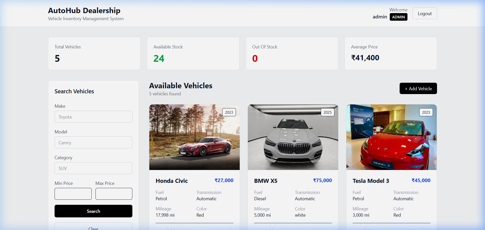
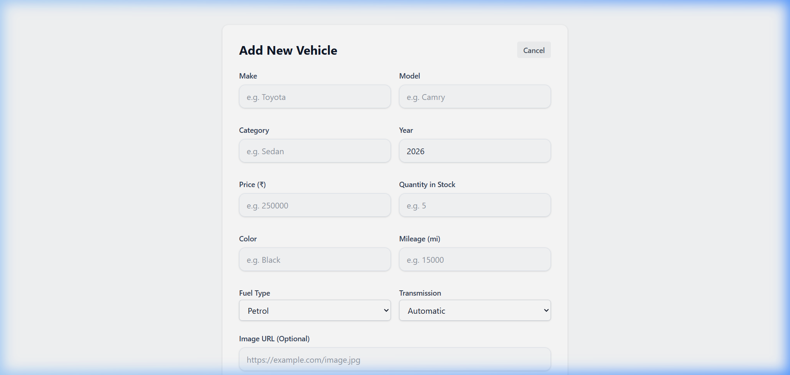

# Car Dealership Inventory System

This is a full-stack Car Dealership Inventory System. It's built with a FastAPI backend (using SQLite and SQLAlchemy) and a React frontend styled with Tailwind CSS. The project was built using Test-Driven Development (TDD) principles to ensure reliable backend logic and proper role-based access control.

---

## Features

### Authentication & Authorization
*   **User Roles:** Separate permissions for **Customers** and **Admins**.
*   **JWT Authentication:** Login and registration generate token payloads to protect routes.
*   **Access Control:** 
    *   *Customers* can browse, search, and purchase vehicles.
    *   *Admins* can add, edit, delete, and restock vehicles.

### Vehicle Management
*   **CRUD Operations:** Admin forms to create, update, and remove vehicles.
*   **Search & Filters:** Real-time search by make, model, category, and price range.
*   **Purchase System:** Customers can purchase vehicles, which decrements stock by 1 (automatically disabled if quantity is 0).
*   **Restock System:** Admins can restock vehicle counts to increase inventory.

---

## Tech Stack

### Backend
*   **FastAPI:** High-performance web framework.
*   **SQLAlchemy:** Database ORM.
*   **SQLite:** local persistent storage.
*   **PyJWT / Jose:** JWT generation and verification.
*   **Pytest:** Test suite runner.

### Frontend
*   **React (Vite):** Modern, fast UI scaffolding.
*   **Tailwind CSS:** Styling.
*   **Axios:** Configured with an interceptor to automatically attach authorization headers.
*   **React Router:** For routing and path protections.

---

## Getting Started

### Backend Setup
1.  Navigate to the backend folder:
    ```bash
    cd backend
    ```
2.  Set up and activate a Python virtual environment:
    ```bash
    python -m venv .venv
    
    # On Windows:
    .\.venv\Scripts\Activate.ps1
    
    # On macOS/Linux:
    source .venv/bin/activate
    ```
3.  Install dependencies:
    ```bash
    pip install -r requirements.txt
    ```
4.  Start the local server:
    ```bash
    uvicorn app.main:app --reload
    ```
    The API will run at `http://localhost:8000`.

### Running Tests
Make sure your virtual environment is active, then run:
```bash
pytest
```
This runs the full suite (49 passing tests) verifying routes, database schemas, auth checks, and negative bounds (e.g. buying out-of-stock vehicles).

### Frontend Setup
1.  Navigate to the frontend folder:
    ```bash
    cd frontend
    ```
2.  Install dependencies:
    ```bash
    npm install
    ```
3.  Run the development server:
    ```bash
    npm run dev
    ```
    The web page will open at `http://localhost:5173`.

---

## Screenshots


#### Login Page


#### Customer Dashboard (Search & Filters)


#### Admin Actions (Add & Edit Forms)


---

## My AI Usage

### Tools Used
*   **Gemini 3.5 Flash** (via the Antigravity Agentic IDE extension)

### How I Used It
1.  **Auth & Route Guards:** I had the AI help write the FastAPI dependencies (`get_current_user` and `get_admin_user`) to parse incoming headers, decode the JWT token, and check if the user had the required `ADMIN` role.
2.  **Database Updates:** I used it to write the SQLAlchemy queries in the repository layer to filter search variables (make, model, price ranges) and safely decrement or increment vehicle stock.
3.  **React Routing:** The AI assisted in setting up protected routes in `AppRoutes.jsx` (like `PrivateRoute` and `AdminRoute`) so users are redirected appropriately if they try to access admin pages.
4.  **TDD Support:** The AI helped write boilerplate pytest test cases for the endpoints, making it easier to follow the Red-Green-Refactor flow.

### Reflection
Using the AI assistant made writing boilerplate code (like Pydantic models, basic repository CRUD, and Tailwind forms) much faster. It allowed me to focus on designing the database relations and structuring the authentication checks. 

The main challenge was making sure database sessions were handled correctly in tests and that CORS settings allowed the React dev server to communicate with the backend. I had to review the AI's suggestions carefully to ensure role restrictions were correctly applied in the backend dependencies, but overall, it cut development time significantly.
